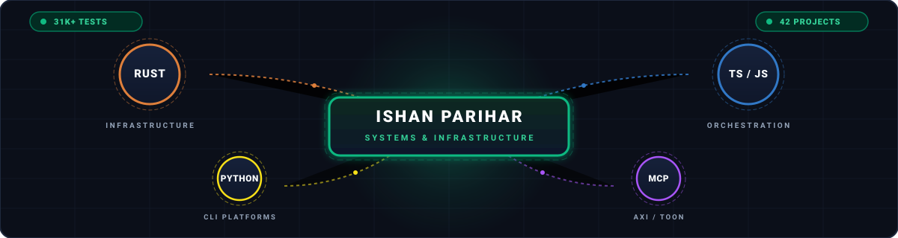

**Agentic AI Systems Engineer & Operator** · Production Agentic Infrastructure · AI-Augmented Architecture · Multi-Agent Orchestration

📧 [contact@ishanparihar.com](mailto:contact@ishanparihar.com) · 🌐 [ishanparihar.com](https://ishanparihar.com) · 🔗 [LinkedIn](https://www.linkedin.com/in/ishan-parihar/)
📍 Noida, India · ✈️ Remote: worldwide

---

## 📊 Engineering by the Numbers

I design and implement custom cognitive substrates, low-overhead tools, and high-throughput communication routing layers. The operational scope of this portfolio covers:

| Metric | Value | Technical Context & Evidence |
|--------|-------|------------------------------|
| **Active Projects** | **42** | 8 S-tier · 8 A-tier · 9 B-tier · 9 C-tier · 1 D-tier · 1 knowledge-base · 6 websites (separate category) — tiered by the objective [ranking rubric](./RANKING-RUBRIC.md) |
| **MCP Servers** | **20+** | 1,300+ total tools across intelligence, memory, media, social, and life-ops |
| **Rust Crates** | **99+** | 99 `Cargo.toml` manifests — `operant` 19, `automaton` 17, `scorestrata` 12, `mindstrata` 8 |
| **Lines of Code** | **2.38M** | 2,380,188 tracked source lines (Rust, TypeScript, Python, Go, Kotlin) |
| **Automated Tests** | **31,300+** | 31,364 test markers — top suites: `operant` 9.2K, `holosim` 7.7K, `mindstrata` 1.2K, `linkedin-lyr` 1.1K |
| **Context Reduction** | **40–60%** | Token savings verified via custom Token-Oriented Object Notation (TOON) compiler |
| **Production Runtime** | **<10MB** | Stripped static musl Rust binaries with minimal idle RSS, zero dynamic dependencies |

> All metrics are machine-measured from the repositories — no self-reported numbers.
> Performance claims (context reduction, runtime footprint) are benchmark-verified on the linked flagships.

---

## 🎯 Value Proposition — Proof, Not Promises

I'm an **Agentic AI Systems Engineer & Operator** — I direct AI-augmented builds of the graph engines, compilers, and protocol layers that make autonomous AI agents functional, resilient, and cost-effective under real production loads. **Substrates are chosen per project (Rust, TypeScript, Python, Go, Kotlin) — never as identity.** Outcomes over protocols; operator, not coder. **Every flagship below points to the proof living in its own repository** — playable demos, runnable test suites, and measured benchmarks. Open the repo and verify it yourself.

| Flagship | What it does | Proof lives in the repo |
|---|---|---|
| 🎵 **[scorestrata](https://github.com/ishan-parihar/scorestrata)** | Plain-language brief → mastered, byte-identical WAV | **"Hear it" section** — two rendered demo tracks (LP nu-metal, nu-disco) with spectrogram showcases + `ss render` commands to regenerate. 944 tests enforce the no-regression rules |
| 🧠 **[tdg-rust](https://github.com/ishan-parihar/tdg-rust)** | Pure-Rust cognitive memory engine — every memory a `(Content, Embedding, Telos)` node | **"Testing" section** — clone and run: `cargo test` = 626 passing (449 lib + 68 MCP e2e + 44 plugin + integration + property suites, per badge) |
| 📊 **[deckmill](https://github.com/ishan-parihar/deckmill)** | Browserless carousel factory — 46 slide types, zero Chromium | **Real exports** — `docs/previews/` holds 6 slides actually rendered by the embedded Blitz engine (no browser, no screenshots) |
| 📡 **[browsefleet](https://github.com/ishan-parihar/browsefleet)** | Stealth browser fleet for agents — leased CDP contexts | **"Proof" section** — live benchmark table: 380 ms first nav, Turnstile auto-pass, reCAPTCHA v3 0.9 |
| 🤖 **[operant](https://github.com/ishan-parihar/operant)** | Terminal-native ReAct agent runtime — 60+ tools, memory, MCP | **"Quick start"** — `./scripts/install.sh` + `operant setup && operant chat`; runnable in three commands |

---

### 💼 Hire Me — or verify the code yourself first

For founding / forward-deployed engagements, agentic-systems architecture, or fractional CTO work for AI-first teams — [📧 contact@ishanparihar.com](mailto:contact@ishanparihar.com). I ship production agentic infrastructure end-to-end via AI-augmented architecture; substrates chosen for the project, not the team. Or audit the code first: start from the portfolio's highest-test-count runtime ([Operant](https://github.com/ishan-parihar/operant), 9,249 tests) or the compact fully-verified engine ([TDG Rust](https://github.com/ishan-parihar/tdg-rust), 626 tests).

---

## ⚙️ Core Paradigm: How I Operate

I treat AI system design as **spatial machinery** rather than linear text prompting, and I direct its construction via **AI-augmented architecture** — systems thinking first, substrates chosen per project, the agent runtime writing the implementation under operator supervision. Most agent frameworks today are fragile prompt wrappers. I deliver **load-bearing substrates**:

* **Operator-led, AI-augmented builds**: I architect the system, set the test discipline, choose the substrate (Rust/TypeScript/Python/Go/Kotlin), and direct the build. The 31,000+ tests across the portfolio are the audit trail of that method — not the result of typing each line by hand.
* **Graph-Native Orchestration**: I replace linear shell scripts and standard pipelines with property graphs. Every execution node has typed ports; the execution engine resolves dependencies, materializes parallel branches using a Tokio-backed level scheduler, and exposes the live execution DAG to LLM operators via MCP.
* **Token-Efficient Serialization**: I designed and compiled the TOON (Token-Oriented Object Notation) standard. By eliminating structural syntax redundancy, TOON reduces context-window footprint by 40% to 60% compared to standard JSON, preserving deterministic validation.
* **Minimal Memory footprint**: I specialize in compiling highly optimized, zero-dependency static musl Rust binaries. My intelligence gathering pipelines (IGS) curate 411 sources across 47 countries while running within a 7MB static file and under 5MB of idle RAM.
* **Systems Diagnostics**: Drawing on my background in architectural design, spatial diagnostics, and cognitive modeling, I translate systemic risk, organizational constraints, and multi-agent network topologies into deterministic software constraints.

---

## 💎 Flagship Projects

### 🤖 [operant](https://github.com/ishan-parihar/operant)
**Terminal-native ReAct agent runtime.** Rust. 9,249 tests. MCP client + server, skills, messaging channels.

A production-grade agent runtime written in Rust that runs from your shell: a real think → act → observe loop with a JSON-schema tool registry, memory-context injection every turn, provider fallbacks, and self-healing retries.

* **Memory**: `agentmemory` hybrid semantic memory (BM25 + vector + graph), auto-spawned on first use; optional Postgres backend.
* **Tools**: 60+ JSON-schema tools — fs, git, web, CDP browser, shell, code, http, memory, skills, cron, kanban, notes, checkpoints.
* **Channels**: Telegram · Discord · Slack · WhatsApp via the gateway; WASM plugins; `operant autonomous` dev loop.
* **Local-first**: no telemetry, no account; any OpenAI-compatible endpoint or a local llama.cpp / Ollama model.

### 🎬 [openscript](https://github.com/ishan-parihar/openscript)
**Agent-directed video editing pipeline.** Rust + TypeScript. 109 MCP tools, 510 tests.

A full agent-native media pipeline: take a brief, generate a script, synthesize voices, cut a timeline, and render — driven end-to-end through MCP tools rather than a GUI.

* **Pipeline**: brief → script → TTS → vision → FFmpeg → Remotion render, orchestrated as MCP tool calls.
* **Depth**: 12/12 measured sophistication families (state machines, DSLs, protocols, storage, determinism, plugins…) across 5 languages.
* **Surface**: 109 MCP tools — the widest tool surface in the portfolio after operant.

### 🧠 [mysterium](https://github.com/ishan-parihar/mysterium)
**Education-system replacement — holonic developmental matrix.** TS + Python. 61K LOC, 1,090 tests.

A structured cognitive curriculum engine: a 64-cell developmental matrix with a holonic growth model, plus a **9-command agent-first CLI** (`setup`, `status`, `new-game`, `diagnostic`, `curriculum`, `session`, `glossary`, `profile`, `setup-profile`) — an AXI-style surface agents drive directly from the shell.

* **Matrix**: 64-cell developmental grid; curriculum, session, and profile state machines over it.
* **Surface**: `mysterium` bin globally installable; deterministic, non-interactive commands.
* **Skills**: ships structured skill libraries (workspace-lint, ui-ux-pro-max, ui-styling) as reusable agent tooling.

### 💼 [linkedin-lyr](https://github.com/ishan-parihar/linkedin-lyr)
**Professional profile extraction + Voyager profile-edit surface.** Python. 51K LOC, 1,166 tests, 94 releases.

A full LinkedIn integration with a **25-command agent-first CLI** and the most complete AXI ergonomics in the portfolio (6/6 axi.md signals). Every interaction is machine-parseable: TOON structured output, a `--full` escape hatch from content truncation, definitive empty states, size-hinted truncation, pre-computed `total_count` aggregates, and structured exit codes.

* **AXI 6/6**: the only portfolio repo implementing every axi.md principle end-to-end.
* **Surface**: 25 CLI commands; profile fetch, search, and edit flows agents drive deterministically.
* **Track record**: 94 releases — the most shipped tool in the lyr family.

### 📡 [sourcehound](https://github.com/ishan-parihar/sourcehound)
**Intelligence Gathering System — High-performance Rust engine.** ~7MB static binary, ~5MB RSS.

A lightweight news and data ingestion pipeline scraping 411 distinct sources across 47 countries. It filters, deduplicates, and enriches global national, tech, and financial news, generating optimized intelligence feeds for agent consumption.

* **Serialization**: Outputs natively in TOON, saving 40% to 60% in downstream context window costs.
* **Parsers**: 9 custom-engineered stream parsers handling RSS, Atom, HTML tables, OFAC lists, and PDF archives.
* **Efficiency**: Developed to replace a slow, high-memory Node.js prototype, dropping idle RAM consumption to under 5MB.

### 🌐 [social-forge](https://github.com/ishan-parihar/social-forge)
**Multi-platform intelligence gatherer and scheduler across 25 platforms.** Rust. ~78K LOC.

A Rust backend with an axum REST API + rmcp MCP server, JWT auth, SSE realtime, and an in-process scheduler for cross-platform social content operations — Reddit, LinkedIn, Instagram, Telegram, Threads, Facebook, YouTube, Discord, and X/Twitter.

### 🧠 [tdg-rust](https://github.com/ishan-parihar/tdg-rust)
**Teleological Developmental Graph — Pure Rust cognitive engine.** 626 tests. 50 MCP tools.

A complex implementation of stateful agent memory using a holonic graph structure. Every memory unit is represented as a node: `(Content, Embedding, Telos)`. The teleological decay algorithm ensures stale or irrelevant context decays over time while highly relevant goal nodes remain active.

* **Interface**: 50 custom MCP tools allowing agents to write, link, prune, and query memories using vector search combined with graph traversal.
* **Validation**: 626 tests total — zero warnings, zero regressions, verified against the current suite.
* **Canonical**: The Rust port supersedes the original Python reference (now private); `tdg-rust` is the single canonical TDG project.

### 🎵 [scorestrata](https://github.com/ishan-parihar/scorestrata)
**Contract-first music compiler — from plain-language brief to mastered WAV.** Rust. 12 crates, 944 tests.

A deterministic composition compiler that turns a human brief into a full-length WAV: event-sourced composition state, a validator gate with genre/register/layer checks, a production-grade layered synth, and a mastering chain. Same brief → byte-identical audio, every run.

* **Pipeline**: Brief → plan → compile → validate → render → master.
* **Audio**: Production-grade layered synth voices (SF2-sampled drums, doubled guitar, organics) with per-layer spectral auditing.
* **Determinism**: Byte-identical replay from contract + seed; 944 tests enforce no-regression rules.

### 📊 [deckmill](https://github.com/ishan-parihar/deckmill)
**The browserless slide factory.** Rust. 46 slide types, 185 tests, ~35K LOC.

High-quality Instagram / LinkedIn / TikTok / X carousels as HTML → PNG via an embedded Blitz renderer — **no Chromium, no browser, no screenshot hacks**. 4.5× less memory than headless-Chrome pipelines, fully static musl binary, WCAG-AA contrast auditing, and an MCP server for AI-driven generation.

### 🧠 [mindstrata](https://github.com/ishan-parihar/mindstrata)
**Deterministic emergent human-society simulation — every agent a complete mind.** Rust. 82K LOC, 1,245 tests.

Not just a "society sim": a full cognitive-science stack — bodies, nervous systems, appraisal-based emotion, belief systems, social bonds, institutions, culture, and noospheric fields. Three architecture plans (AP1 → AP2 → AP3) deepen it from a medieval settlement into a multi-scale civilization simulation where history always emerges from locally bounded agents.

---

## 🛠️ The Complete Ecosystem

I consolidate all tools, servers, and platforms under clear protocol interfaces. This is the operational landscape of my systems:

### Unified MCP & Agent Infrastructure

| System | Stack | Surface | Description |
|--------|-------|---------|-------------|
| **[sourcehound](https://github.com/ishan-parihar/sourcehound)** | Rust | 93 Tools | Lightweight intelligence aggregator scraping 411 sources in 47 countries |
| **[social-forge](https://github.com/ishan-parihar/social-forge)** | Rust | MCP + REST | Multi-network content ops engine (25 platforms, JWT auth, SSE realtime) |
| **[openscript](https://github.com/ishan-parihar/openscript)** | Rust/TS | 109 Tools | AI-directed video editing pipeline (TTS, FFmpeg, Remotion) |
| **[tdg-rust](https://github.com/ishan-parihar/tdg-rust)** | Rust | 50 Tools | Teleological developmental graph memory and knowledge synthesizer |
| **[c-suite-agents](https://github.com/ishan-parihar/c-suite-agents)** | TypeScript | 35 Tools | Multi-agent orchestration daemon + LifeOS MCP server (LanceDB + Telegram) |
| **[automaton](https://github.com/ishan-parihar/automaton)** | Rust | 38 Tools | Graph-native build, plan, and scheduled execution engine |
| **[deckmill](https://github.com/ishan-parihar/deckmill)** | Rust | 20 Tools | Browserless carousel factory — 46 slide types, embedded Blitz renderer |
| **[browsefleet](https://github.com/ishan-parihar/browsefleet)** | Node/TS | REST + CDP | Stealth browser fleet: leased CDP contexts, sessions/screenshots/PDFs for agents |
| **[thinking-steroid](https://github.com/ishan-parihar/thinking-steroid)** | TypeScript | 13 Tools | Forced epistemic cognitive modes (first-principles, polarity mapping, etc.) |
| **[andrometry](https://github.com/ishan-parihar/andrometry)** | Kotlin/Go | 12 Tools | Personal context engine: Kotlin Android collector with a Go MCP server |
| **[lifeos-ops](https://github.com/ishan-parihar/lifeos-ops)** | Rust | 31 Tools | Unified CLI + MCP server for Notion-based LifeOS |
| **[lifeos-bot](https://github.com/ishan-parihar/lifeos-bot)** | Python | Telegram MCP | LifeOS conversational interface — activity/diet/journal/financial logging |
| **[hermes-prime-bridge](https://github.com/ishan-parihar/hermes-prime-bridge)** | Python | 3 Tools | Live plugin importing Prime Agent's persistent kernel into Hermes's stateless runtime |

### Agent-Native Platform CLIs (`-lyr` / `-cli`) & Obscura

One shared AXI-compliant architecture: every tool speaks TOON/YAML output, structured errors, and contextual help; `obscura-core` is the shared cookie-vault daemon underneath the browser-scraping family.

| Tool | Stack | Surface | Description |
|------|-------|---------|-------------|
| **[linkedin-lyr](https://github.com/ishan-parihar/linkedin-lyr)** | Python | 25 Tools | Professional profile extraction and company intelligence scraping |
| **[twitter-lyr](https://github.com/ishan-parihar/twitter-lyr)** | Python | 42 Tools | Agent-native X/Twitter integration handling DMs, media, and search |
| **[facebook-lyr](https://github.com/ishan-parihar/facebook-lyr)** | Python | 41 Tools | Facebook / Messenger MCP server via cookie-based scraping |
| **[instagram-lyr](https://github.com/ishan-parihar/instagram-lyr)** | Python | 47 Tools | Stealth profile reconnaissance and HTTPX-based media scraper |
| **[tg-cli](https://github.com/ishan-parihar/tg-cli)** | Python | 12 Tools | Fast Telethon-powered Telegram messaging automation client |
| **[meme-lyr](https://github.com/ishan-parihar/meme-lyr)** | TypeScript | 6 Tools | AXI-compliant structured image overlay and meme generator |
| **[reddit-lyr](https://github.com/ishan-parihar/reddit-lyr)** | Python | 32 Tools | Dense Reddit scraping, analysis, and interaction CLI |
| **[discord-cli](https://github.com/ishan-parihar/discord-cli)** | Python | 13 Tools | Local-first Discord data CLI (SQLite sync, search, analytics) |
| **[obscura-core](https://github.com/ishan-parihar/obscura-core)** | Python | 8 Tools | Stealth browser integration: cookie vault + CDP daemon powering the lyr family |
| **[threads-lyr](https://github.com/ishan-parihar/threads-lyr)** | Python | 3 Tools | Threads.net MCP server via anonymous scraping |

### Portfolios & Web User Interfaces (Separate Category — not tiered)

| Platform | Tech Stack | Architecture & Operational Details |
|----------|------------|-----------------------------------|
| 🔒 **[ishanparihar-svelte](https://github.com/ishan-parihar/ishanparihar-svelte)** | SvelteKit 5 / Supabase | Core platform with Razorpay integrations, authentication, MDX CMS |
| 🔒 **[law-of-one-india-website](https://github.com/ishan-parihar/law-of-one-india-website)** | Next.js 15 / Postgres | Community publishing hub with custom caching, role-based auth, MDX |
| 🔒 **[design-aesthetics-website](https://github.com/ishan-parihar/design-aesthetics-website)** | SvelteKit / Tailwind | Architectural portfolio: 49K LOC, GSAP, WebGL shaders, Three.js |
| 🔒 **[lifeos-website](https://github.com/ishan-parihar/lifeos-website)** | Next.js 15 / Tailwind | Platform documentation hub and production marketing page |
| 🔒 **[webdev-portfolio](https://github.com/ishan-parihar/webdev-portfolio)** | Next.js / TypeScript | Freelance portfolio scaffold — agent prompt + design system; site source lives in the nested `my-portfolio` repo |
| 🔒 **[ishanparihar-cms](https://github.com/ishan-parihar/ishanparihar-cms)** | TypeScript | Web backend exposing 60+ CMS tools for content management |

---

## 🔬 Unified Tech Stack Matrix

- **Languages**: Rust, TypeScript, Python, Kotlin, Go, SQL, Zig, Bash, MQL5
- **Protocols**: Model Context Protocol (MCP), Agent eXperience Interface (AXI), TOON Serialization
- **Infrastructure**: Docker, systemd services, PostgreSQL, SQLite, Supabase, LanceDB, n8n automation
- **AI/ML Integration**: local LLMs (llama.cpp, Qwen), OpenAI, Anthropic, Gemini, Whisper, Whisper Hinglish

---

## 📂 Complete Project Catalog (42 Projects)

> 🔒 = private repository — **available on request**. Contact me for access.

> **Tiers are scored objectively** — see the [ranking rubric](./RANKING-RUBRIC.md) for the
> machine-measured dataset, the published formulas, and the documented cap policy.

<b>🚀 S-TIER: Flagship Systems — Score ≥ 8.0 (8 Projects)</b>

 

* **[operant](https://github.com/ishan-parihar/operant)** `9.57`: Terminal-native ReAct agent runtime — 538K LOC, 9,249 tests, 19 crates, 12/12 sophistication families (state machines, DSLs, storage, determinism, plugins…).
* **[openscript](https://github.com/ishan-parihar/openscript)** `8.96`: Agent-directed video editing pipeline — 109 MCP tools, 510 tests, 12/12 sophistication families, 5 languages.
* **[mysterium](https://github.com/ishan-parihar/mysterium)** `8.55`: Education-system replacement — 64-cell developmental matrix, holonic curriculum, 1,090 tests, 10 sophistication families, 9-command AXI-first CLI (5/6 signals).
* **[social-forge](https://github.com/ishan-parihar/social-forge)** `8.42`: 78K LOC across 25 platforms (registry-verified), 10 sophistication families, 328 MCP tools across 42 tool modules.
* **[scorestrata](https://github.com/ishan-parihar/scorestrata)** `8.39`: WAV music compiler — 12 crates, 944 tests, 88 MCP tools, 9 sophistication families (state machines, graphs, DSLs, determinism, render/audio…). 73K LOC.
* **[linkedin-lyr](https://github.com/ishan-parihar/linkedin-lyr)** `8.12`: Professional profile extraction + Voyager profile-edit surface. 1,166 tests, 25 CLI commands, 9 sophistication families, 6/6 axi.md signals.
* **[tdg-rust](https://github.com/ishan-parihar/tdg-rust)** `8.04`: Teleological developmental graph memory — 626 tests, 50 MCP tools, 11 sophistication families, 10 releases.
* **[sourcehound](https://github.com/ishan-parihar/sourcehound)** `8.03`: High-speed news ingestion pipeline — 11 sophistication families, 93 MCP tools, 15 releases, 411 sources in 47 countries.

<b>🧠 A-TIER: Production-Grade Engines — Score 6.5–7.99 (8 Projects)</b>

 

* **[c-suite-agents](https://github.com/ishan-parihar/c-suite-agents)** `7.62`: Multi-agent daemon + bundled LifeOS MCP server (35 tools, LanceDB/SQLite + Telegram). 227 tests, 10 sophistication families.
* **[instagram-lyr](https://github.com/ishan-parihar/instagram-lyr)** `7.44`: Stealth Instagram profile scraper. 335 tests, 47 CLI commands, 5/6 axi signals.
* **[deckmill](https://github.com/ishan-parihar/deckmill)** `7.36`: Browserless carousel factory — 46 slide types, embedded Blitz renderer, 20 MCP tools, 185 tests, 6 releases, 10 sophistication families.
* **[mindstrata](https://github.com/ishan-parihar/mindstrata)** `7.34`: Deterministic emergent society simulation — 8 crates, 82K LOC, 1,245 tests, 10 measured sophistication families (state machines, graphs/holonics, DSLs, determinism, plugins…).
* **[twitter-lyr](https://github.com/ishan-parihar/twitter-lyr)** `7.32`: Agent-native X/Twitter integration. 243 tests, 42 CLI commands, 32 releases, 5/6 axi signals.
* **[facebook-lyr](https://github.com/ishan-parihar/facebook-lyr)** `7.30`: Facebook / Messenger CLI. 229 tests, 41 CLI commands.
* **[automaton](https://github.com/ishan-parihar/automaton)** `7.05`: Graph-native automation substrate — 17 Rust crates, 38 MCP tools, 8 sophistication families.
* **[browsefleet](https://github.com/ishan-parihar/browsefleet)** `6.54`: Stealth browser fleet — CDP pool proxying sessions/screenshots/PDFs to agents. 22 REST endpoints, 86 tests, 4 languages.

<b>📡 B-TIER: Solid Utilities — Score 4.5–6.49 (9 Projects)</b>

 

* **[thinking-steroid](https://github.com/ishan-parihar/thinking-steroid)** `6.37`: Forced cognitive mode engine implementing 13 analysis frameworks. 247 tests, 13 MCP tools, 5 sophistication families.
* **[andrometry](https://github.com/ishan-parihar/andrometry)** `6.12`: Personal context engine — Kotlin Android collector with a Go REST server. 152 tests.
* **[reddit-lyr](https://github.com/ishan-parihar/reddit-lyr)** `6.02`: Comprehensive Reddit scraper with 32 MCP tools for agents (browse, post, comment, vote, mod).
* **[tg-cli](https://github.com/ishan-parihar/tg-cli)** `5.95`: Fast Telethon-powered Telegram automation client. 122 tests, 14 releases, 5/6 axi signals.
* **[meme-lyr](https://github.com/ishan-parihar/meme-lyr)** `5.32`: TypeScript CLI meme generator. 25 tests, tag-only CI + release pipeline, v2.0.0.
* **[lifeos-ops](https://github.com/ishan-parihar/lifeos-ops)** `5.20`: Unified CLI + MCP server for Notion-based LifeOS. 31 tools, 8 sophistication families — zero automated tests across 18K Rust LOC.
* **[discord-cli](https://github.com/ishan-parihar/discord-cli)** `4.93`: Local-first Discord data CLI (SQLite sync, search, analytics). 10 releases, 2 CI workflows.
* **[threads-lyr](https://github.com/ishan-parihar/threads-lyr)** `4.86`: Threads.net MCP server. 31 tests.
* **[lifeos-bot](https://github.com/ishan-parihar/lifeos-bot)** `4.76`: LifeOS conversational interface — Telegram bot + agent CLI (simulate/direct/debug). 12K LOC, 33 tests, v0.1.0.

<b>🧰 C-TIER: Operational & Capped — Score 3.25–4.49 or policy-capped (9 Projects)</b>

 

* **[kali-mahabali](https://github.com/ishan-parihar/kali-mahabali)** `8.33` (capped): Modular intelligence framework — Codename Chimera. Interchangeable modules (reasoning, memory, tools, models) snapping into a central spine. 63K LOC (Rails engine), CI build, MIT license. Experimental.
* **[icode](https://github.com/ishan-parihar/icode)** `7.23` (capped): Rust command runner parsing agent file edit logs — 11 sophistication families, 2,095 tests. Archived.
* **[holosim-infinite](https://github.com/ishan-parihar/holosim-infinite)** `7.11` (capped): Math simulator tracking emergent agent interactions — 489K LOC, 7,766 tests, 11 sophistication families. Experimental.
* **[kali-mahabali](https://github.com/ishan-parihar/kali-mahabali)** `7.08` (capped): Modular sandbox testing raw agent behaviors (Codename: Project Chimera). Experimental. 🔒
* **[consciousness-fabricator](https://github.com/ishan-parihar/consciousness-fabricator)** `6.40` (capped): Audio pipeline compiling dynamic background sounds. 158 tests + architecture docs. Experimental.
* **[CineSync](https://github.com/ishan-parihar/CineSync)** `5.62`: Character-asset automation pipeline for lipsync animation. 13.7K LOC, 2 CI workflows. Archived.
* **[obscura-core](https://github.com/ishan-parihar/obscura-core)** `4.38`: Shared cookie-vault + CDP daemon powering the lyr family — highest cross-repo in-degree (4 dependents).
* **[workout-factory](https://github.com/ishan-parihar/workout-factory)** `3.93`: Archived trainer voice/audio-cache factory.
* **[hermes-prime-bridge](https://github.com/ishan-parihar/hermes-prime-bridge)** `3.92`: Live plugin bridging a persistent kernel into Hermes's stateless runtime. 3 MCP tools, 14 contract tests, v0.2.0.

<b>📉 D-TIER: Minimal / Stalled (1 Project)</b>

 

* 🔒 **[lifeos-saas](https://github.com/ishan-parihar/lifeos-saas)** `2.62`: Agent hosting stack (NullClaw, Honcho, Postgres). 760 LOC, 0 tests.

<b>📚 KNOWLEDGE-BASE (1 Project — Spec Corpus, Not Ranked as Software)</b>

 

* **[HoloOS](https://github.com/ishan-parihar/HoloOS)**: Enterprise systems modeling & topological risk — a knowledge/spec corpus (14K YAML + 1.2K MD, 98 executable Python files) with a `holos` CLI (80+ subcommands) and MCP server. Tracked separately from software, pending engineering verification.

---

### 🌐 Portfolios & Web User Interfaces (Separate Category — 6 Projects)

> Delivery artifacts — a separate category, not tiered against the software rubric.

* 🔒 **[ishanparihar-svelte](https://github.com/ishan-parihar/ishanparihar-svelte)**: SvelteKit 5 platform managing MDX blogs and Razorpay payments.
* 🔒 **[law-of-one-india-website](https://github.com/ishan-parihar/law-of-one-india-website)**: Publishing platform handling community user management.
* 🔒 **[design-aesthetics-website](https://github.com/ishan-parihar/design-aesthetics-website)**: Architectural visual landing page. GSAP animations, Three.js shaders.
* 🔒 **[lifeos-website](https://github.com/ishan-parihar/lifeos-website)**: Technical marketing page and documentation outline for LifeOS.
* 🔒 **[webdev-portfolio](https://github.com/ishan-parihar/webdev-portfolio)**: Freelance portfolio scaffold (agent prompt + design system); site source in the nested `my-portfolio` repo.
* 🔒 **[ishanparihar-cms](https://github.com/ishan-parihar/ishanparihar-cms)**: Web backend exposing 60+ CMS tools for content management.

---

## 🧭 The Arc: Space → Mind → Infrastructure

Three disciplines shaped this body of work — and each is visible in how the systems are built.

- **Architecture** taught me to think in space and load-bearing structure. A program is a container with designed constraints, not a linear recipe — so every repo here is engineered like a building: for what it must carry under real load.
- **Psychology** taught me to study minds. That's why the portfolio runs deep into cognitive systems — teleological memory graphs (`tdg-rust`), deterministic society simulations (`mindstrata`), developmental matrices (`mysterium`). Building for agents means building for cognition.
- **Engineering** fuses both into infrastructure: compilers, runtimes, and protocol layers that let autonomous agents operate at production scale (`operant`, `automaton`, `igs-rust`, `social-forge`).

The throughline across all of it is the same: **I build infrastructure for AI agents to operate at production scale** — deterministic where it matters, verifiable everywhere, and proven by the artifacts committed beside the code.

---

**Available for remote contract, full-time, and part-time roles worldwide.**  
**[📧 contact@ishanparihar.com](mailto:contact@ishanparihar.com) — let's build the infrastructure of tomorrow.**

---

## ☕ Sponsor this work

Every sponsorship funds the open ecosystem behind this profile — new releases, test suites, CI, and infrastructure across all 42 projects:

Your support funds new features, releases, and infrastructure for the whole ecosystem.
